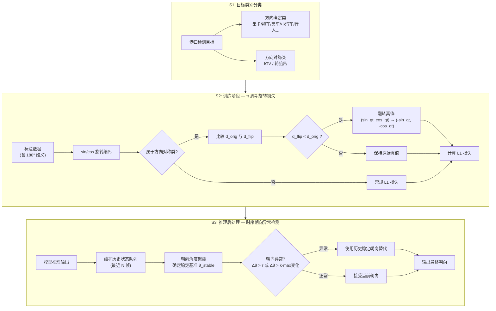
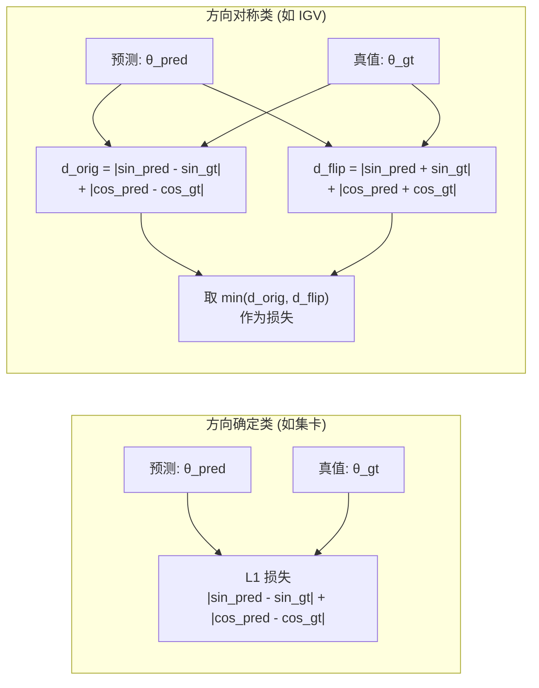
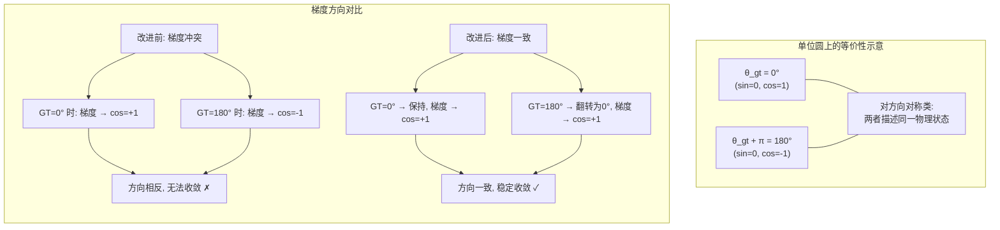
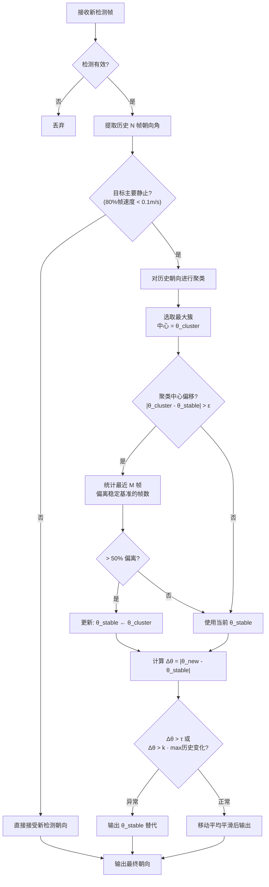
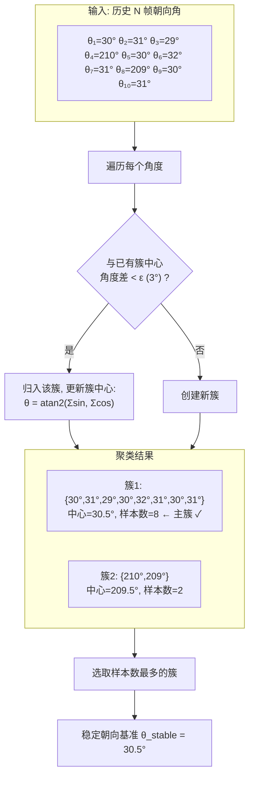

# 专利附图（Mermaid 草稿）

> 用 Typora 或支持 Mermaid 的编辑器打开即可预览

---

## 图1：整体流程示意图

---

## 图2：π 周期旋转损失原理示意图

---

## 图3：时序朝向异常检测工作流程图

---

## 图4：朝向角度聚类示意图

---

## 图5：实验对比（表格形式，需转为柱状图）

| 类别 | 改进前 AOE (rad) | 改进后 AOE (rad) | 降幅 |
|------|:---:|:---:|:---:|
| IGV-Full | 0.650 | < 0.20 | > 69% |
| IGV-Empty | 0.673 | < 0.20 | > 70% |
| WheelCrane | 1.105 | < 0.30 | > 73% |
| Car (参考) | 0.045 | 0.045 | - |
| Truck (参考) | 0.026 | 0.026 | - |

> 注: 改进后数据待训练完成后填入真实值
