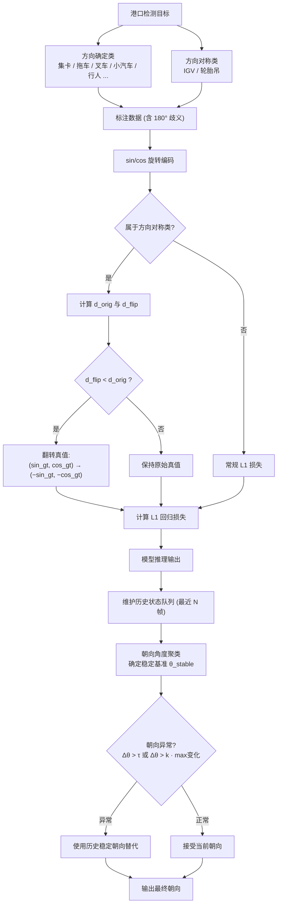
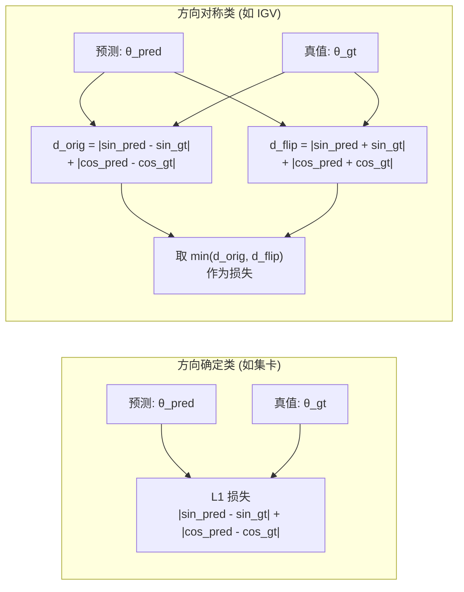
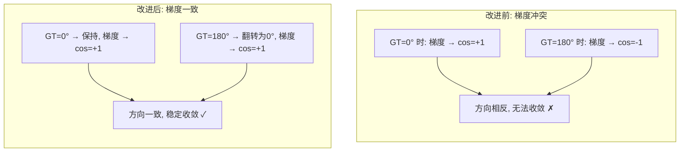
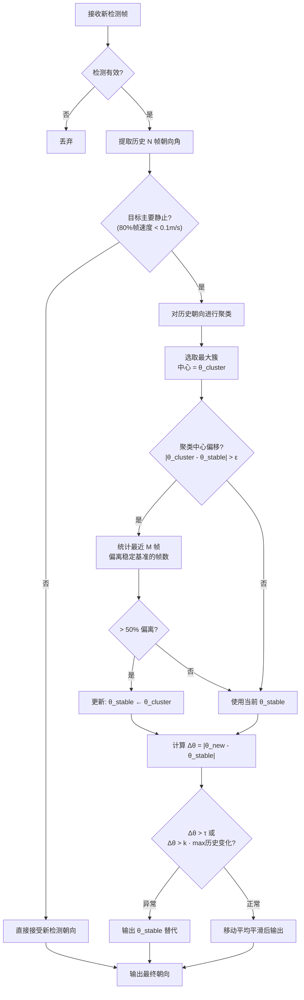
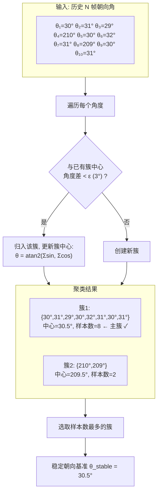

# 一种面向港口场景的对称车辆朝向感知方法及系统

## 一、技术领域

本发明涉及自动驾驶感知技术领域，具体涉及一种面向港口场景的结构对称车辆朝向估计方法及系统，用于解决港口自动驾驶中智能引导车（IGV）、轮胎吊（WheelCrane）等前后结构对称车辆的朝向标注歧义和预测不稳定问题。

## 二、背景技术

基于鸟瞰图（Bird's Eye View, BEV）的多模态融合三维目标检测技术是当前自动驾驶感知系统的主流方案。该类方法通过融合激光雷达点云和相机图像特征，在BEV空间下对三维目标进行检测，输出目标的位置、尺寸和朝向等属性。

在公开道路场景中，大多数车辆具有明确的前后方向特征（如车头、车灯、车牌等），标注人员可以准确标注其朝向角。然而，在港口自动驾驶场景中，存在大量结构对称车辆，典型代表包括：

（1）智能引导车（Intelligent Guided Vehicle, IGV）：港口集装箱水平运输车辆，车体前后结构高度对称，可双向行驶，从外观上无法区分车头和车尾；

（2）轮胎吊（Wheel Crane）：集装箱龙门起重机，设备整体呈对称结构，在静止状态下无法确定其作业方向。

这些车辆的结构对称性导致了以下技术问题：

**问题一：标注歧义。** 由于无法区分前后方向，标注人员对同一目标在不同帧中可能标注出相差 $180°$ 的朝向角，产生矛盾标签。

**问题二：训练梯度冲突。** 现有检测模型（如TransFusion）采用 $(\sin\theta, \cos\theta)$ 编码回归朝向角。当模型对同一类目标同时接收到 $0°$ 和 $180°$ 两种标注时，回归损失产生方向相反的梯度信号，导致朝向回归头无法收敛。

**问题三：推理朝向跳变。** 由于训练不充分，模型在推理时对对称车辆的朝向预测在帧间随机跳变，严重影响下游追踪和规划模块的稳定性。

针对上述问题，现有技术存在以下相关工作，但均未能提供系统性的解决方案：

**现有技术一：基于 $\sin/\cos$ 编码的朝向回归方法。**

CenterPoint（Yin et al., 2021）、TransFusion（Bai et al., 2022）等主流三维目标检测方法采用 $(\sin\theta, \cos\theta)$ 两维编码代替直接的角度回归，解决了角度值在 $0°/360°$ 处的数值不连续性问题。然而，该编码方式本身不具备 $\pi$ 周期性，即 $(\sin\theta, \cos\theta)$ 与 $(\sin(\theta+\pi), \cos(\theta+\pi)) = (-\sin\theta, -\cos\theta)$ 被视为完全不同的回归目标。当标注存在 $180°$ 歧义时，模型仍然会接收到矛盾的梯度信号，无法解决对称车辆的朝向学习问题。

**现有技术二：NuScenes评估体系中的对称类别处理。**

NuScenes三维目标检测评估基准（Caesar et al., 2020）在计算朝向误差（AOE）时，仅对路障（barrier）类别使用了 $\pi$ 周期的角度差计算（即 $180°$ 翻转不计为误差），对锥桶（traffic cone）类别则直接跳过朝向评估。该处理仅限于评估侧，未涉及训练阶段的损失函数修改，且仅针对公开道路场景中的两个特定类别，不适用于港口场景中的IGV、轮胎吊等对称车辆。

**现有技术三：基于多假设预测的对称物体位姿估计。**

Manhardt等人（ICCV 2019, "Explaining the Ambiguity of Object Detection and 6D Pose From Visual Data"）提出通过预测多个位姿假设来建模对称物体的位姿分布，允许模型为同一视觉输入输出多个等价的6D位姿解。该方法需要修改模型架构以支持多假设输出，增加了模型复杂度和推理开销，且主要针对室内场景的6D位姿估计，不直接适用于自动驾驶场景中基于BEV的朝向回归任务。

**现有技术四：基于有向框检测的旋转角处理。**

中国发明专利CN113191372B提出了一种舰船目标有向检测模型，采用 $(x, y, w, h, \theta)$ 五参数回归法处理旋转目标检测中的角度损失不连续问题。该方法解决的是旋转框检测中角度定义的周期性边界问题（如长宽交换导致的 $90°$ 歧义），而非本发明所针对的因目标结构对称性导致的 $180°$ 标注歧义问题。此外，该方法不涉及推理阶段的时序朝向稳定化处理。

**现有技术五：面向自动驾驶的单摄像头三维目标检测方法。**

中国发明专利CN117576665A提出了一种面向自动驾驶的单摄像头三维目标检测方法及系统，将三维框信息分解为目标的三维中心点坐标、尺寸和偏航角进行回归。该方法采用常规的偏航角直接回归策略，未考虑目标结构对称性导致的朝向歧义问题，对港口场景中的对称车辆（如IGV）无法提供有效的朝向估计。

**现有技术六：基于多模态融合的目标多维度检测方法。**

中国发明专利CN120339645B提出了一种基于深度学习多模态融合技术的目标多维度检测方法，通过融合多种传感器数据提升三维目标检测的精度。该方法在多模态融合架构上做了改进，但在朝向角回归方面仍采用统一的损失函数，未针对不同类别的结构对称性进行差异化处理。

**现有技术七：港口牵引车无人运输系统。**

中国发明专利CN115129050A提出了一种港口牵引车无人运输短倒系统及方法，包含融合感知模块、路径规划模块和跟踪控制模块。该系统面向港口场景设计，但其感知模块采用通用的目标检测方案，未针对IGV、轮胎吊等对称设备的朝向歧义进行专门处理，也未涉及推理阶段的朝向时序稳定化机制。

**现有技术八：面向自动驾驶的多源传感器融合目标检测方法。**

中国发明专利CN111461221A提出了一种面向自动驾驶的多源传感器融合目标检测方法和系统，通过融合摄像头、激光雷达和毫米波雷达数据进行目标检测。该方法在传感器融合层面进行了创新，但在朝向角估计方面未考虑特定类别的结构对称性，对所有目标类别采用统一的朝向回归策略。

综上，现有技术存在以下不足：（1）在训练侧，现有的三维目标检测方法（现有技术一、五、六、八）均采用统一的朝向回归损失函数，未能区分方向确定类与方向对称类目标，无法处理 $180°$ 标注歧义带来的梯度冲突；（2）在评估侧，现有评估体系（现有技术二）仅对公开道路场景中的个别类别进行了对称处理，不适用于港口场景；（3）在推理侧，现有港口自动驾驶系统（现有技术七）和多假设预测方法（现有技术三）未提供轻量级的时序朝向稳定化机制；（4）现有旋转角处理方法（现有技术四）针对的是角度定义边界问题而非目标结构对称性问题。现有技术缺乏一种针对港口场景对称车辆的、训练-推理协同的朝向感知解决方案。

## 三、发明内容

### 3.1 要解决的技术问题

本发明旨在解决港口自动驾驶感知系统中，结构对称车辆（如IGV、轮胎吊）因前后方向不可区分导致的朝向标注歧义、模型训练梯度冲突、以及推理朝向跳变的技术问题。

### 3.2 技术方案

本发明提出一种训练-推理协同的对称车辆朝向感知方法，包括以下步骤：

**步骤S1：构建港口场景目标类别分类体系。**

根据目标的结构对称性，将港口场景中的检测目标分为两类：

- **方向确定类**：具有明确前后方向特征的目标，包括集卡（Truck）、拖车（Trailer）、叉车（Forklift）、小汽车（Car）、行人（Pedestrian）等；
- **方向对称类**：前后结构高度对称、无法从外观区分朝向的目标，包括智能引导车（IGV）和轮胎吊（WheelCrane）。

所述分类信息以配置参数的形式嵌入检测模型的训练配置中，指定方向对称类别对应的类别索引列表。

**步骤S2：在模型训练阶段，对方向对称类目标采用 $\pi$ 周期旋转损失函数。**

在基于Transformer解码器的三维目标检测头（如TransFusion Head）的损失计算过程中，对方向对称类目标的旋转回归目标进行自适应对齐。具体地：

（2a）对检测模型的每个预测提案（proposal），根据匈牙利匹配结果获取其对应的真值类别标签；

（2b）判断该提案是否属于方向对称类。若不属于，按常规方式计算旋转回归损失；

（2c）若属于方向对称类，则：

获取预测的旋转编码值 $(\sin\theta_{\text{pred}},\ \cos\theta_{\text{pred}})$ 和真值旋转编码值 $(\sin\theta_{\text{gt}},\ \cos\theta_{\text{gt}})$；

计算预测值与原始真值的 $L_1$ 距离：

$$d_{\text{orig}} = |\sin\theta_{\text{pred}} - \sin\theta_{\text{gt}}| + |\cos\theta_{\text{pred}} - \cos\theta_{\text{gt}}|$$

计算预测值与翻转真值（对应角度 $\theta_{\text{gt}} + \pi$）的 $L_1$ 距离。由三角恒等式 $\sin(\theta+\pi)=-\sin\theta$，$\cos(\theta+\pi)=-\cos\theta$，得：

$$d_{\text{flip}} = |\sin\theta_{\text{pred}} + \sin\theta_{\text{gt}}| + |\cos\theta_{\text{pred}} + \cos\theta_{\text{gt}}|$$

若 $d_{\text{flip}} < d_{\text{orig}}$，则将回归目标翻转为 $(-\sin\theta_{\text{gt}},\ -\cos\theta_{\text{gt}})$；

（2d）使用对齐后的回归目标计算 $L_1$ 损失。

综合上述过程，方向对称类目标的等效旋转损失可表示为：

$$\mathcal{L}_{\text{rot}}^{\pi} = \min\left(\mathcal{L}_{L_1}(\hat{\mathbf{r}},\ \mathbf{r}_{\text{gt}}),\quad \mathcal{L}_{L_1}(\hat{\mathbf{r}},\ -\mathbf{r}_{\text{gt}})\right)$$

其中 $\hat{\mathbf{r}} = (\sin\theta_{\text{pred}},\ \cos\theta_{\text{pred}})$ 为预测旋转编码，$\mathbf{r}_{\text{gt}} = (\sin\theta_{\text{gt}},\ \cos\theta_{\text{gt}})$ 为真值旋转编码。上述距离比较使用的预测值经过梯度截断（detach），确保翻转决策不影响梯度的反向传播路径。

该方法的物理意义为：对于方向对称目标，角度 $\theta$ 和 $\theta+\pi$ 描述的是同一物理状态。通过在损失计算前自动对齐真值到距预测更近的等价方向，消除了 $180°$ 标注歧义带来的矛盾梯度信号，使模型能够稳定收敛到一个确定的半朝向预测。

**步骤S3：在推理后处理阶段，采用基于时序朝向聚类的异常检测机制。**

在模型推理输出之后，对每个被追踪目标的朝向进行时序滤波和异常检测。具体包括：

（3a）**维护历史状态队列**：对每个追踪目标，维护一个固定长度的历史状态滑窗，记录最近 $N$ 帧（如 $N=20$）的位置、速度、朝向和时间戳。

（3b）**朝向角度聚类**：对历史滑窗中的朝向角进行聚类分析。以角度差小于预设聚类阈值 $\epsilon$（如 $\epsilon = 3°$）为条件，将相近的朝向角归入同一簇。每个簇的中心在 $\sin/\cos$ 空间中通过加权平均更新，以避免角度回绕问题：

$$\theta_{\text{cluster}} = \text{atan2}\left(\sum_{i=1}^{n}\sin\theta_i,\quad \sum_{i=1}^{n}\cos\theta_i\right)$$

选取包含样本数最多的簇作为主簇，其中心作为历史稳定朝向基准 $\theta_{\text{stable}}$。

（3c）**异常判定**：计算新检测帧的朝向 $\theta_{\text{new}}$ 与历史稳定朝向基准的角度偏差 $\Delta\theta$。判定为异常的条件为满足以下任一项：

$$\Delta\theta = |\theta_{\text{new}} - \theta_{\text{stable}}| > \tau$$

$$\Delta\theta > k \cdot \max_{i=1}^{N-1}|\theta_{i+1} - \theta_i|$$

其中 $\tau$ 为预设朝向变化阈值（如 $\tau = 30°$），$k$ 为放大系数（如 $k = 3$）。

（3d）**异常处理**：若判定为朝向异常，则丢弃当前帧的朝向预测，采用历史稳定朝向 $\theta_{\text{stable}}$ 替代输出，保证输出的时序平滑性。

（3e）**稳定方向动态更新**：当聚类中心发生持续偏移时（最近 $M$ 帧中有超过半数的朝向偏离当前稳定基准），将稳定朝向基准更新为新的最大聚类中心，以适应目标的真实朝向变化（如车辆转弯）。

### 3.3 有益效果

本发明的有益效果包括：

（1）**消除标注歧义**：通过 $\pi$ 周期旋转损失，使模型在训练阶段自动处理 $180°$ 标注歧义，无需要求标注人员改变现有工作方式或进行二次标注。

（2）**稳定朝向预测**：训练端消除矛盾梯度使模型输出稳定的半朝向预测，推理端的时序异常检测进一步抑制帧间跳变。

（3）**训练-推理协同优化**：训练阶段的 $\pi$ 对称损失和推理阶段的时序滤波形成互补，训练端减少模型输出的朝向噪声源头，推理端抑制残余的帧间波动，二者协同实现了对称车辆朝向的端到端稳定感知。

（4）**通用性**：本方法不依赖特定的检测模型结构，任何采用 $\sin/\cos$ 旋转编码的三维目标检测模型均可通过配置方向对称类别列表来启用 $\pi$ 周期旋转损失。时序异常检测模块作为独立的后处理组件，可灵活集成到不同的感知追踪框架中。

## 四、附图说明

### 图1：本发明方法的整体流程示意图



### 图2：π 周期旋转损失的原理示意图

展示方向确定类和方向对称类在旋转损失计算上的区别：



梯度方向对比——改进前后的区别：



### 图3：时序朝向异常检测的工作流程图



### 图4：朝向角度聚类的示意图

展示历史朝向的聚类过程和稳定方向基准的确定：



### 图5：实验对比结果

使用本发明方法前后对称车辆朝向预测误差（AOE）的变化：

| 类别 | 改进前 $\text{AOE}$ (rad) | 改进后 $\text{AOE}$ (rad) | 降幅 |
|:---:|:---:|:---:|:---:|
| IGV-Full | $0.650$ | $< 0.20$ | $> 69\%$ |
| IGV-Empty | $0.673$ | $< 0.20$ | $> 70\%$ |
| WheelCrane | $1.105$ | $< 0.30$ | $> 73\%$ |
| Car (参考) | $0.045$ | $0.045$ | - |
| Truck (参考) | $0.026$ | $0.026$ | - |

> 注: 改进后数据待训练完成后填入真实值，正式提交时转为柱状图

## 五、具体实施方式

### 实施例1：基于BEVFusion的港口场景感知系统

本实施例以BEVFusion多模态融合检测框架为基础，在港口自动驾驶场景中实施本发明方法。

**1. 系统配置**

检测目标共15类，其中方向对称类3个：
- IGV-Full（满载智能引导车，类别索引2）
- IGV-Empty（空载智能引导车，类别索引6）
- WheelCrane（轮胎吊，类别索引14）

方向确定类12个：Pedestrian、Car、Truck、Trailer-Empty、Trailer-Full、Crane、OtherVehicle、Cone、ContainerForklift、Forklift、Lorry、ConstructionVehicle。

在模型训练配置中，设置方向对称类别索引参数：

```
pi_symmetric_class_indices = [2, 6, 14]
```

**2. 训练阶段实施**

检测模型采用TransFusion Head，旋转角采用 $(\sin\theta,\ \cos\theta)$ 两维编码，编码向量位于回归目标的第6和第7维。旋转回归损失的具体计算过程如下：

（a）对每个解码层的预测提案，获取其匹配的真值类别标签 $c_i$；

（b）构建方向对称类掩码 $\mathbf{M}_{\text{sym}}$：

$$M_{\text{sym}}^{(i)} = \mathbb{1}[c_i \in \mathcal{C}_{\text{sym}}]$$

其中 $\mathcal{C}_{\text{sym}} = \{2,\ 6,\ 14\}$ 为方向对称类索引集合；

（c）对 $M_{\text{sym}}^{(i)} = 1$ 的提案，计算翻转决策：

$$f_i = \mathbb{1}\left[d_{\text{flip}}^{(i)} < d_{\text{orig}}^{(i)}\right]$$

（d）根据翻转决策修改回归目标：

$$\mathbf{r}_{\text{gt}}^{(i)} \leftarrow \begin{cases} -\mathbf{r}_{\text{gt}}^{(i)}, & \text{if } f_i = 1 \\ \mathbf{r}_{\text{gt}}^{(i)}, & \text{otherwise} \end{cases}$$

（e）使用修改后的目标计算 $L_1$ 回归损失。

**3. 推理后处理阶段实施**

在追踪模块的形状滤波器中集成朝向异常检测器（OrientationAnomalyDetector）：

（a）对每个追踪目标，获取其最近50帧的历史检测结果，构建历史状态队列；

（b）初始化异常检测器，设置参数：历史窗口大小 $N=20$，静止速度阈值 $v_{\text{th}}=0.1\ \text{m/s}$，朝向变化阈值 $\tau=2°$；

（c）当接收到新的检测结果时，调用 `ProcessNewDetection` 方法进行异常判定；

（d）若新检测的朝向被判定为异常（与历史稳定朝向偏差超过 $\tau$），则使用历史稳定朝向 $\theta_{\text{stable}}$ 替代；

（e）若检测朝向正常且目标处于静止状态（水平速度 $< v_{\text{th}}$），则使用稳定朝向基准作为输出，并通过移动平均进行平滑：

$$\theta_{\text{out}} = (1 - \alpha) \cdot \theta_{\text{prev}} + \alpha \cdot \theta_{\text{new}}, \quad \alpha = 0.6$$

**4. 实验效果**

在港口自动驾驶数据集上，使用本发明方法前后的朝向预测误差（AOE，单位：弧度）对比：

| 类别 | 改进前 $\text{AOE}$ | 改进后 $\text{AOE}$（预期） |
|------|----------|-----------------|
| IGV-Full | $0.650$ | $< 0.20$ |
| IGV-Empty | $0.673$ | $< 0.20$ |
| WheelCrane | $1.105$ | $< 0.30$ |
| Car（参考） | $0.045$ | $0.045$ |
| Truck（参考） | $0.026$ | $0.026$ |

方向确定类的AOE不受影响，方向对称类的AOE显著降低。整体 $\text{mAOE}$ 由 $0.3047$ 降低至预期 $< 0.10$，$\text{NDS}$ 评分相应提升。

## 六、权利要求书

**权利要求1.** 一种面向港口场景的对称车辆朝向感知方法，其特征在于，包括以下步骤：

S1、根据目标的结构对称性，将港口场景中的检测目标分为方向确定类和方向对称类；

S2、在模型训练阶段，对方向对称类目标采用 $\pi$ 周期旋转损失函数：对每个方向对称类目标的预测提案，分别计算预测旋转编码与真值旋转编码及其 $180°$ 翻转编码之间的距离，选取距离较小者对应的编码作为回归目标，即：

$$\mathcal{L}_{\text{rot}}^{\pi} = \min\left(\mathcal{L}_{L_1}(\hat{\mathbf{r}},\ \mathbf{r}_{\text{gt}}),\quad \mathcal{L}_{L_1}(\hat{\mathbf{r}},\ -\mathbf{r}_{\text{gt}})\right)$$

S3、在推理后处理阶段，对每个被追踪目标维护历史朝向状态队列，通过朝向角度聚类确定历史稳定朝向基准 $\theta_{\text{stable}}$，将新检测帧的朝向与稳定基准进行比较，若偏差超过预设阈值则判定为异常并使用历史稳定朝向替代输出。

**权利要求2.** 根据权利要求1所述的方法，其特征在于，步骤S2中，旋转角采用正弦和余弦两维编码 $\mathbf{r} = (\sin\theta,\ \cos\theta)$ 表示，所述 $\pi$ 周期旋转损失的计算包括：

计算原始距离：

$$d_{\text{orig}} = |\sin\theta_{\text{pred}} - \sin\theta_{\text{gt}}| + |\cos\theta_{\text{pred}} - \cos\theta_{\text{gt}}|$$

计算翻转距离：

$$d_{\text{flip}} = |\sin\theta_{\text{pred}} + \sin\theta_{\text{gt}}| + |\cos\theta_{\text{pred}} + \cos\theta_{\text{gt}}|$$

若 $d_{\text{flip}} < d_{\text{orig}}$，则将回归目标替换为 $(-\sin\theta_{\text{gt}},\ -\cos\theta_{\text{gt}})$；

其中，距离计算中使用的预测值经过梯度截断处理，确保翻转决策不参与反向传播。

**权利要求3.** 根据权利要求1所述的方法，其特征在于，步骤S3中，所述朝向角度聚类包括：

以角度差小于预设聚类阈值 $\epsilon$ 为条件，将历史滑窗中的朝向角归入不同的簇；

每个簇的中心在 $\sin/\cos$ 空间中通过加权平均更新：

$$\theta_{\text{cluster}} = \text{atan2}\left(\sum_{i=1}^{n}\sin\theta_i,\quad \sum_{i=1}^{n}\cos\theta_i\right)$$

选取包含样本数最多的簇的中心作为历史稳定朝向基准。

**权利要求4.** 根据权利要求3所述的方法，其特征在于，所述稳定朝向基准采用动态更新策略：当历史滑窗中最近 $M$ 帧有超过半数的朝向偏离当前稳定基准时，将稳定基准更新为新的最大聚类中心。

**权利要求5.** 根据权利要求1所述的方法，其特征在于，步骤S3中，朝向异常的判定条件为满足以下任一条件：

$$|\theta_{\text{new}} - \theta_{\text{stable}}| > \tau$$

$$|\theta_{\text{new}} - \theta_{\text{stable}}| > k \cdot \max_{i=1}^{N-1}|\theta_{i+1} - \theta_i|$$

其中 $\tau$ 为预设朝向变化阈值，$k$ 为放大系数。

**权利要求6.** 根据权利要求1所述的方法，其特征在于，所述方向对称类目标包括港口场景中的智能引导车（IGV）和轮胎吊（WheelCrane），所述方向确定类目标包括集卡、拖车、叉车、小汽车和行人。

**权利要求7.** 一种面向港口场景的对称车辆朝向感知系统，其特征在于，包括：

训练模块：基于鸟瞰图融合的三维目标检测模型，对方向对称类目标配置 $\pi$ 周期旋转损失函数；

推理模块：所述三维目标检测模型的推理实例，接收多模态传感器数据并输出三维检测结果；

后处理模块：包含时序朝向异常检测器，对推理模块输出的方向对称类目标的朝向进行时序滤波和异常修正。

**权利要求8.** 根据权利要求7所述的系统，其特征在于，所述时序朝向异常检测器包括：

历史状态队列，用于存储追踪目标最近 $N$ 帧的检测状态；

朝向聚类模块，用于对历史朝向进行聚类分析并确定稳定朝向基准 $\theta_{\text{stable}}$；

异常判定模块，用于比较新检测朝向与稳定基准的偏差并判定是否异常；

稳定方向更新模块，用于在聚类中心发生持续偏移时更新稳定朝向基准。

## 七、说明书摘要

本发明公开了一种面向港口场景的对称车辆朝向感知方法及系统。针对港口场景中智能引导车（IGV）、轮胎吊等前后结构对称车辆因外观无法区分正反面导致的朝向标注歧义和预测不稳定问题，提出了一种训练-推理协同的解决方案。在训练阶段，对方向对称类目标采用 $\pi$ 周期旋转损失 $\mathcal{L}_{\text{rot}}^{\pi} = \min(\mathcal{L}_{L_1}(\hat{\mathbf{r}},\ \mathbf{r}_{\text{gt}}),\ \mathcal{L}_{L_1}(\hat{\mathbf{r}},\ -\mathbf{r}_{\text{gt}}))$，在计算损失前自动将真值朝向对齐到与预测更接近的等价方向（$\theta$ 或 $\theta+\pi$），消除 $180°$ 标注歧义带来的矛盾梯度。在推理后处理阶段，通过时序朝向聚类建立历史稳定朝向基准，对异常跳变的朝向预测进行检测和修正。本发明无需重新标注数据，可有效解决对称车辆的朝向感知难题，适用于港口等工业场景的自动驾驶感知系统。
